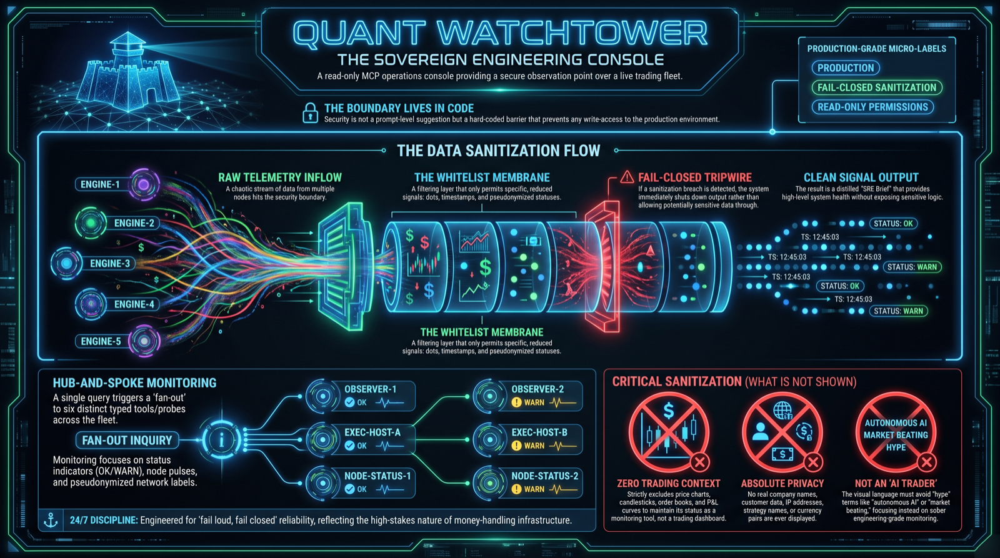
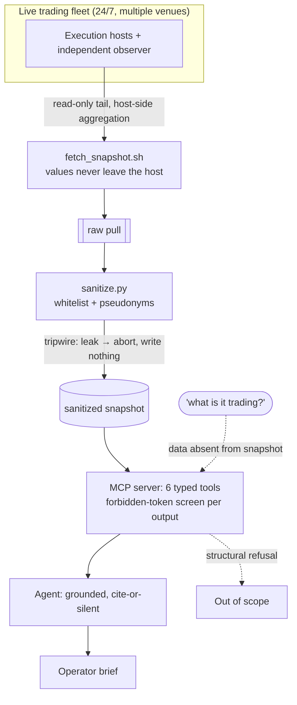

# Quant Watchtower

**A read-only MCP operations console for a 24/7 algorithmic trading fleet.** One plain-language question fans out into six tool calls and comes back as an SRE brief. The sanitization that keeps trading data out of the agent lives in code, not in the prompt. What ships in this repo is a sanitized, runnable sample of that design, driven by synthetic fixtures.

---

## What it is

Quant Watchtower is the monitoring surface for a trading system I designed and operate, which runs unattended across multiple venues around the clock. It is a read-only console: it can observe, verify, and report, but it cannot trade, change configuration, or read a single trade. An agent reaches the fleet only through six typed MCP tools, and everything those tools return is drawn from a sanitized snapshot. This public repo runs that same pipeline on synthetic fixtures, so it is fully runnable without touching anything private.

The interesting part is not that an agent can summarize logs. It is that the boundary between "operational health" and "how the system actually trades" is enforced in the data layer, three walls deep, so the agent is structurally incapable of leaking the strategy even if asked directly.

## What ships here, and what is sanitized

The pipeline is real; the data in this repo is synthetic. `sanitize.py`, the two forbidden-token screens, and the six MCP tools are the actual guardrail code. They run here against `fixtures/raw_sample.json`, a synthetic raw pull that stands in for the running fleet's operational artifacts (heartbeats, reconciliation runs, alert history, audit volumes). Against a live fleet, `fetch_snapshot.sh` (included as a read-only skeleton) supplies that raw pull instead, and nothing else in the pipeline changes.

What is removed, and removed **in code before the agent sees anything**:

- Component identities are replaced with fixed pseudonyms (`exec-host-a/b/c`, `observer`); engines and everything else survive only as counts.
- Only counts, UTC timestamps, statuses, and generic alert classes survive the whitelist.
- Strategy names, venues, symbols, amounts, thresholds, positions, account values, file paths, and infrastructure addresses never enter the snapshot the agent reads from.

This is a deliberate design constraint, not a redaction pass bolted on at the end. The trading logic is private and stays private. What is on display is the engineering and operational discipline of running a money-handling system unattended.

## Demos

https://github.com/user-attachments/assets/5512ad59-2a39-4944-ad11-7f163651c848

**What to watch:** the operator asks "run the daily ops review, anything that should worry me?" The console fans that single question into six tool calls over the snapshot and answers with one brief: heartbeat coverage per component, a run of consecutive verified reconciliations, roughly fifteen hundred audit events in the last day, the one alert that paged and self-recovered within ten minutes, which watchdogs stayed silent and why, and a closing verdict on what would page the owner.

https://github.com/user-attachments/assets/51749728-8527-4cbd-a043-a5fbcce52dd8

**What to watch:** asked what the fleet is trading right now, the console refuses. The refusal is structural, not a polite decline: trading data is stripped in the data layer, so there is nothing in the tools to retrieve. It cannot answer because it cannot see.

## How it works

The architecture is a short list of design decisions, each aimed at making a leak impossible rather than unlikely.

**Read-only, host-side aggregation first.** The pull from the hosts is strictly read-only (tail of operational logs), and the sensitive streams, such as account reconciliation, are aggregated on the host. Account numbers and values never leave the server. Only timestamps and counts travel. In this repo that pull is a synthetic fixture; `fetch_snapshot.sh` ships as a skeleton showing the read-only shape it takes against a live fleet.

**A whitelist, not a blacklist.** The sanitizer builds the agent-visible snapshot from an allowlist of fields, assigns content-independent pseudonyms to components, and reduces everything else to counts, times, and statuses. Anything not explicitly permitted simply does not exist downstream.

**A tripwire that fails closed.** Before the sanitized snapshot is written, a forbidden-token screen scans the whole blob. If anything that smells of un-sanitized content slips through, the sanitizer aborts rather than emit the file. The safe failure is no output.

**A second screen at the tool boundary.** The MCP server reads exclusively from the sanitized snapshot, and every individual tool return passes the forbidden-token screen again on the way out. A hit raises instead of returning. Two independent layers have to fail silently for a single token to escape.

**The agent is a grounded reporter.** The persona is instructed to state only what a tool returned, cite each fact with a component pseudonym and UTC timestamp, and treat coverage gaps, incomplete reconciliations, and alerts without a recovery as findings rather than footnotes. A review always runs the full protocol; it never answers from a subset of tools.

## Stack

| Component | Purpose |
|---|---|
| `fetch_snapshot.sh` | Read-only telemetry pull, shipped as a skeleton; tails operational logs and aggregates sensitive streams host-side so raw values never leave. The repo runs on the synthetic fixture instead |
| `sanitize.py` | Builds the whitelisted, pseudonymized snapshot; aborts on a forbidden token (fail-closed tripwire) |
| `mcp_server.py` | FastMCP server exposing six typed read-only tools, each output re-screened before it returns |
| `test_flow.py` | Frame-check that leak-scans all six tool outputs plus the system prompt before anything is recorded |
| Agent persona | Grounded SRE brief: cite-or-stay-silent, full-protocol reviews, a hard scope boundary stated in code below it |

The six tools: `get_fleet_status`, `get_heartbeat_coverage`, `get_reconciliation_report`, `get_alert_history`, `get_audit_trail_summary`, `get_monitoring_topology`.

## Correctness and the leak guarantee

For a console over a live money-handling system, "correct" means two things: the telemetry is faithful, and the private data provably cannot escape. The second is where the rigor sits.

- **Two independent screens, both fail-closed.** The sanitizer refuses to write a leaking snapshot, and the server refuses to return a leaking tool output. Neither degrades gracefully into a leak; both stop.
- **A whitelist floor.** Because the snapshot is built from an allowlist, a newly added upstream field is invisible by default until someone explicitly permits it. The failure mode is missing data, never surprise disclosure.
- **A pre-record frame check.** `test_flow.py` runs every tool, concatenates the outputs with the system prompt, and scans the whole surface for any venue, symbol, amount, threshold, path, or host name. It has to report a clean pass before a single frame is captured.
- **A structural boundary, tested.** The "what is it trading?" refusal is verified to hold because the data is genuinely absent from the snapshot, not because the model was asked nicely to decline.

This mirrors the discipline the underlying trading system runs on: never trust a single source, fail loud, and prefer a bounded, obvious failure over a quiet one.

## How it is built

I work AI-first, directing AI coding tools to generate and refactor the implementation while I own the architecture, the sanitization boundary, and the failure modes, then read, run, and test what comes back.

## Status and contact

**Sanitized public extract.** The console runs over a trading system I have operated 24/7 for months. This repository ships the guardrail architecture and the tooling shape running on synthetic fixtures, with none of the private internals.

Part of a portfolio of production AI systems. More at **[github.com/janvrsinsky](https://github.com/janvrsinsky)**.

- LinkedIn: [linkedin.com/in/janvrsinsky](https://linkedin.com/in/janvrsinsky)
