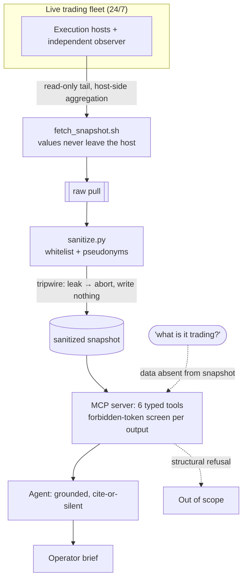

# Quant Watchtower

**A read-only MCP operations console for a 24/7 algorithmic trading fleet.** One plain-language question fans out into six tool calls and comes back as an SRE brief.

**Portfolio exhibit.** This is a sanitized public extract of a private system in daily use. The architecture and method are real; the data and identifiers are stand-ins, and the section "What ships here, and what is sanitized" lists which is which.

[](https://github.com/janvrsinsky/jv-watchtower-mcp/actions/workflows/ci.yml)


**▶ [Watch it run a daily ops review, then refuse to reveal the strategy](#demos)**

## What it does

Watchtower is the monitoring surface for a trading system I designed and operate, running unattended since 2023. An agent reaches the fleet only through six typed read-only MCP tools; everything they return comes from a whitelisted, pseudonymized snapshot. The console observes, verifies, and reports. It cannot trade, change configuration, or read a single trade, and three independent safeguards in the data layer make it structurally incapable of leaking the strategy even when asked directly.



## How to run

The repo runs the real pipeline on synthetic fixtures; no hosts, no keys, standard library only:

```sh
python sanitize.py    # build the whitelisted snapshot from the synthetic raw pull
python test_flow.py   # pipeline gate: all six tool outputs + system prompt leak-scanned
python leak_scan.py   # repo-wide scan of every tracked file, plus a planted-secret self-test
pip install -r requirements.txt && python mcp_server.py   # serve the six MCP tools
```

## What ships here, and what is sanitized

The pipeline is real; the data is synthetic. `sanitize.py`, both forbidden-token screens, and the six MCP tools are the actual guardrail code, running here against `fixtures/raw_sample.json`, a synthetic stand-in for the fleet's operational artifacts (heartbeats, reconciliation runs, alert history, audit volumes). Against a live fleet, `fetch_snapshot.sh` (a read-only skeleton) supplies the raw pull instead; nothing else changes.

Removed in code before the agent sees anything:

- Component identities are replaced with fixed pseudonyms (`exec-host-a/b/c`, `observer`); engines and everything else survive only as counts.
- Only counts, UTC timestamps, statuses, and generic alert classes survive the whitelist.
- Strategy names, venues, symbols, amounts, thresholds, positions, account values, file paths, and infrastructure addresses never enter the snapshot the agent reads from.

The trading logic stays private. On display: the engineering of running a money-handling system unattended.

## How it works

Design decisions, each closing a leak path:

- **Read-only pull, host-side aggregation.** Sensitive streams such as account reconciliation are reduced to counts and statuses on the host; account numbers and values never leave the server.
- **Whitelist.** The snapshot is built from an allowlist of fields with content-independent pseudonyms; everything else survives only as counts, times, and statuses. A new upstream field is invisible by default.
- **Fail-closed tripwire.** A forbidden-token screen scans the whole blob before the snapshot is written; a hit aborts the write, so the safe failure is no output.
- **Second screen at the tool boundary.** Every tool return is re-screened on the way out; a hit raises. Two independent layers have to fail silently for a single token to escape.
- **Grounded reporter.** The persona states only what a tool returned, cites each fact with a pseudonym and UTC timestamp, treats coverage gaps, incomplete reconciliations, and unrecovered alerts as findings, and always runs the full six-tool protocol.

## Demos

https://github.com/user-attachments/assets/5512ad59-2a39-4944-ad11-7f163651c848

**Daily ops review.** One question, six tool calls, one brief: heartbeat coverage per component, a run of consecutive verified reconciliations, roughly fifteen hundred audit events in the last day, one alert that paged and self-recovered within ten minutes, which watchdogs stayed silent and why, and what would page the owner.

https://github.com/user-attachments/assets/51749728-8527-4cbd-a043-a5fbcce52dd8

**Structural refusal.** Asked what the fleet is trading, the console refuses: that data is stripped in the data layer, so the tools have nothing to retrieve. It cannot answer because it cannot see.

## Stack

| Component | Purpose |
|---|---|
| `fetch_snapshot.sh` | Read-only pull skeleton; host-side aggregation. The repo uses the synthetic fixture |
| `sanitize.py` | Whitelist + pseudonyms; aborts on a forbidden token |
| `mcp_server.py` | FastMCP server, six typed read-only tools, outputs re-screened |
| `test_flow.py` | Pipeline gate: tools + prompt leak-scanned, fail-closed proven |
| `leak_scan.py` | Repo-wide scan with a planted-secret negative control |
| Agent persona | Grounded SRE brief (cite or stay silent) with a hard scope boundary |

The six tools: `get_fleet_status`, `get_heartbeat_coverage`, `get_reconciliation_report`, `get_alert_history`, `get_audit_trail_summary`, `get_monitoring_topology`.

## What the CI badge attests

CI runs two fail-closed gates on every push:

- **Pipeline gate (`test_flow.py`).** Runs all six tools, leak-scans every output plus the system prompt, verifies `sanitize(raw_sample)` reproduces the expected snapshot exactly, checks that the path screen ignores URLs, dates, and ratios while catching absolute paths, and proves the tripwire rejects a poisoned pull without writing a file.
- **Repo-wide scan (`leak_scan.py`).** Screens every tracked file for credential assignments, private key blocks, vendor token formats, private network addresses, machine-specific paths, and email addresses. It excludes, with documented reasons, the deliberately dirty synthetic fixture and a negative control of planted fake secrets it must then catch; the run fails unless every planted pattern is detected, so a green badge also proves the scanner can fail.

## How it is built

I work AI-first: AI coding tools generate and refactor the implementation; I own the architecture, the sanitization boundary, and the failure modes, and I read, run, and test what comes back.

## Status and contact

**PRODUCTION EXTRACT.** A sanitized public cut of a private system in real use. The architecture and method are real; data, names, and some components are stand-ins, and this README lists which is which. The private original has run 24/7 since 2023; this repo ships the actual guardrail code on synthetic fixtures, with only the host-side pull as a skeleton and none of the private internals.

Part of a portfolio of production AI systems. More at **[github.com/janvrsinsky](https://github.com/janvrsinsky)**.

- LinkedIn: [linkedin.com/in/janvrsinsky](https://linkedin.com/in/janvrsinsky)

## Topics


